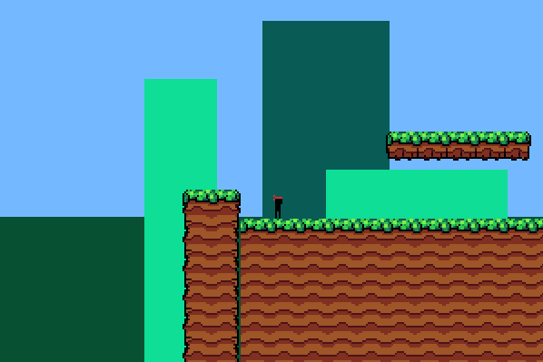

# Py-Engine



This game/game engine was made for fun in python-pygame!
To clone the repository you will need a few things:

1. python
2. pygame
3. GIT
4. PIP

to install pygame use:

```
pip install pygame
```

// Game Stuff
run the **game.py** file and the game should run!
last thing is to **Enjoy**!

// Engine Stuff
install the stuff in this repo to find alot of files such as animations.py, tile_loader.py, etc. And use them in ur projects lol
